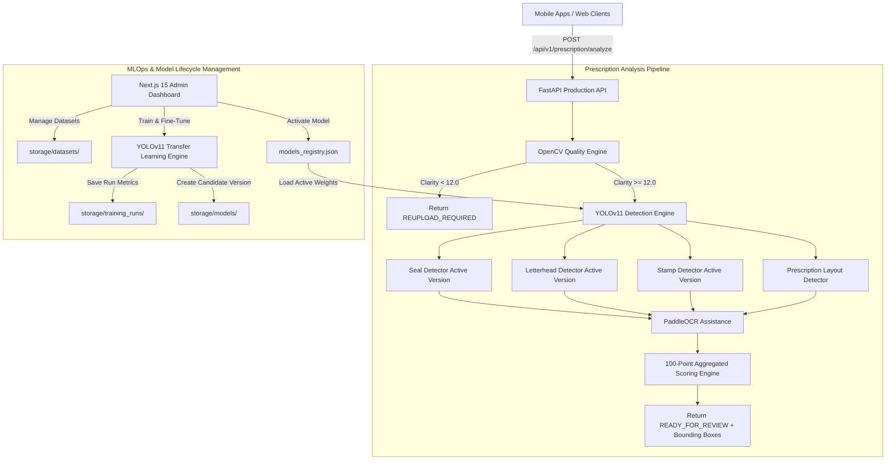
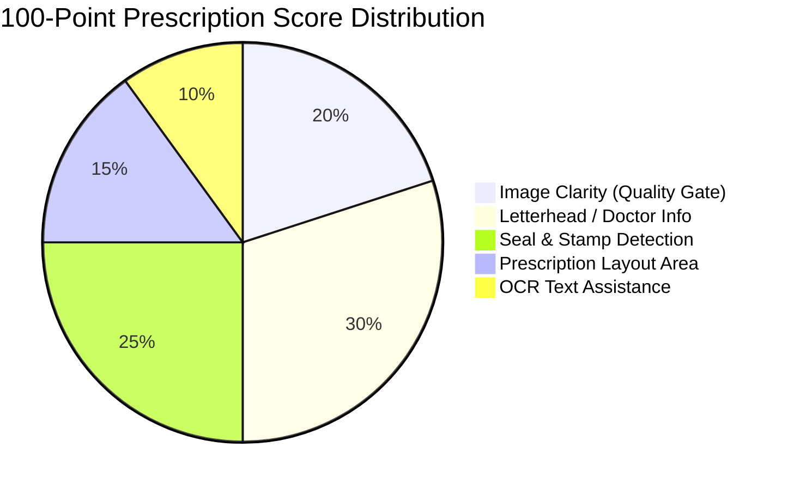
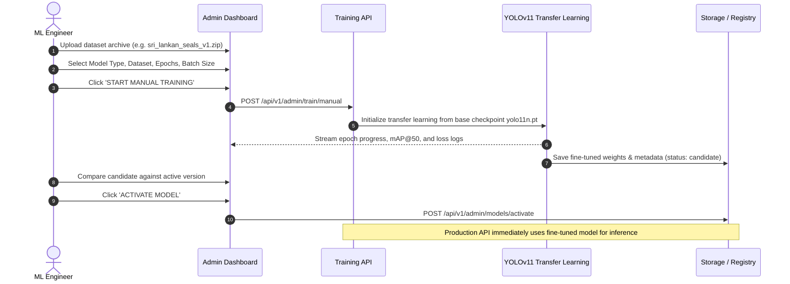
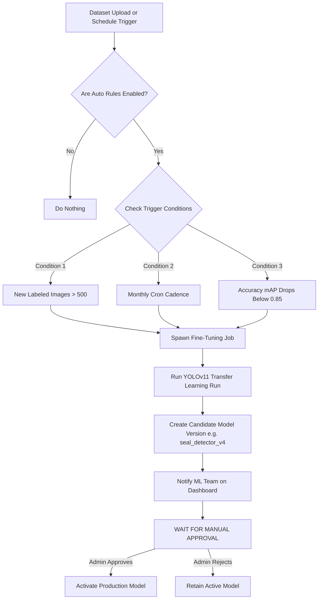

# AI Prescription Analysis Platform

> An industry-quality, production-ready AI Prescription Analysis Platform designed to evaluate prescription image clarity, detect letterheads, seals, stamps, and layout regions, provide optional OCR assistance, compute a unified 100-point AI quality score, and manage YOLOv11 model lifecycles via an internal MLOps dashboard.

---

## System Architecture Diagram



---

## 100-Point Scoring Breakdown & Quality Gate



| Component | Max Score | Evaluation Metrics / Description |
| :--- | :--- | :--- |
| **Image Clarity Gate** | **20 pts** | Laplacian Variance (Blur: 6pts), Noise Sigma (3pts), Lighting/Contrast (4pts), Resolution (4pts), Visibility (3pts). <br/>*If score < 12.0, returns `REUPLOAD_REQUIRED`.* |
| **Letterhead / Doctor Info** | **30 pts** | YOLOv11 bounding box confidence for Hospital Header, Clinic Letterhead, Doctor Reg details. |
| **Seal & Stamp Detection** | **25 pts** | YOLOv11 bounding box confidence for Doctor Seal (15 pts) and Official/Pharmacy Stamp (10 pts). |
| **Prescription Layout** | **15 pts** | Detects Medicine list area, Rx symbol, and Doctor Signature block. |
| **OCR Assistance** | **10 pts** | Optional text structure extraction score. *OCR failure does NOT reject prescription.* |
| **Total** | **100 pts** | Final aggregated confidence score provided to human pharmacist reviewers. |

---

## ML & MLOps Team Guide

### 1. Model Storage & Versioning Architecture

The platform uses a file-based non-destructive versioning layout inside `storage/`:

```
storage/
├── datasets/
│   ├── seal_dataset_v1/
│   └── sri_lankan_seals_v1/
├── models/
│   ├── seal_detector/
│   │   ├── v1/
│   │   │   ├── model.pt
│   │   │   └── metadata.json
│   │   └── v2/
│   │       ├── model.pt
│   │       └── metadata.json
│   ├── letterhead_detector/
│   ├── stamp_detector/
│   └── layout_detector/
├── training_runs/
│   └── run_001/
│       └── results.json
└── models_registry.json
```

---

### 2. Fine-Tuning Pre-Trained YOLOv11 Models (Domain Adaptation)

You do not need to train models from scratch. Instead, fine-tune pre-trained YOLOv11 base weights (`yolo11n.pt`) on domain-specific prescription datasets (e.g. Sri Lankan hospital/clinic seals).



#### Step-by-Step Fine-Tuning Instructions:
1. Navigate to **Datasets** tab on the Dashboard (`http://localhost:3000`).
2. Enter dataset identifier (e.g., `sri_lankan_seals_v1`) and upload your annotated zip file.
3. Navigate to **Training** tab.
4. Select target detector (e.g. `Seal Detector`), select `sri_lankan_seals_v1`, set epochs (`50`), batch size (`16`), and image size (`640`).
5. Click **START MANUAL TRAINING**.
6. The engine automatically freezes base visual layers and fine-tunes detection heads on Sri Lankan seal/stamp images.
7. Monitor live epoch progress, mAP@50 graphs, and loss logs.
8. Once completed, navigate to **Models** tab to compare accuracy and click **Activate** to route production API requests to your fine-tuned model.

---

### 3. Automatic Training Workflow & Triggers

Automatic Training automatically trains new candidate models when specific trigger conditions are met.



> [!IMPORTANT]
> **Safety Guarantee**: Automatic training will **NEVER** automatically replace active production models. Every automatically trained model is stored as a `candidate` version and requires explicit manual activation by an ML Engineer or Administrator.

#### Configuring Automatic Rules:
1. Navigate to **Training** tab on the Dashboard.
2. Locate the **Automatic Training Rules** card.
3. Toggle status to **ENABLED**.
4. Configure triggers:
   - **Min Images Threshold**: `500`
   - **Schedule Interval**: `monthly`
   - **Accuracy Threshold Trigger**: `0.85 mAP`
5. Save settings (`POST /api/v1/admin/train/automatic-rules`).

---

## UI & Workbench Guide

### 1. Prescription Testing Workbench (`/prescription-testing`)
- **Purpose**: Postman replacement for instant visual testing.
- **Features**:
  - Drag-and-drop prescription image upload.
  - Interactive canvas bounding box overlay (Seal = Emerald, Letterhead = Amber, Stamp = Cyan).
  - Quick load sample presets (**Clear Rx** vs **Blurry Rx**).
  - Raw JSON API response viewer with copy support.

### 2. Model Management Dashboard (`/models`)
- **Purpose**: Version control and active deployment manager.
- **Features**:
  - Displays version history (`v1`, `v2`, `v3`) for all 4 detectors.
  - Displays mAP accuracy metrics and trained date.
  - One-click **Activate** button with instant zero-downtime hot swapping.

### 3. Training & Logs Monitor (`/training`)
- **Purpose**: Real-time training control room.
- **Features**:
  - Hyperparameter controls (Epochs, Batch Size, Image Size).
  - Live progress bar, epoch counter, mAP@50 metrics, and terminal log output console.

---

## Quickstart Guide

### Prerequisites
- Docker & Docker Compose
- Python 3.12+ (if running locally without Docker)
- Node.js 20+ (if running frontend locally)

### Option A: Docker Setup (Recommended)

```bash
# 1. Clone repository
git clone https://github.com/your-org/ai-prescription-analysis.git
cd ai-prescription-analysis

# 2. Launch with Docker Compose
docker-compose up --build
```

- **Frontend Dashboard**: `http://localhost:3000`
- **FastAPI API Base**: `http://localhost:8000/api/v1`
- **Interactive Swagger Docs**: `http://localhost:8000/docs`

### Option B: Local Development Setup

#### 1. Backend Setup
```bash
cd backend
python -m venv venv
# On Windows:
venv\Scripts\activate
# On Linux/macOS:
source venv/bin/activate

pip install -r requirements.txt
python main.py
```

#### 2. Frontend Setup
```bash
cd frontend
npm install
npm run dev
```

---

## Mobile App Integration Guide (iOS / Android / Flutter)

To analyze prescriptions from mobile apps:

```typescript
// Example React Native / Mobile fetch request
const analyzePrescription = async (imageUri: string) => {
  const formData = new FormData();
  formData.append('file', {
    uri: imageUri,
    type: 'image/jpeg',
    name: 'prescription.jpg',
  });

  const response = await fetch('http://YOUR_API_HOST:8000/api/v1/prescription/analyze', {
    method: 'POST',
    body: formData,
    headers: {
      'Content-Type': 'multipart/form-data',
    },
  });

  const data = await response.json();
  
  if (data.status === 'REUPLOAD_REQUIRED') {
    alert('Photo is too blurry. Please retake photo under clear light.');
  } else {
    console.log('Final Score:', data.final_score);
    console.log('Detected Bounding Boxes:', data.seal_detection);
  }
};
```
